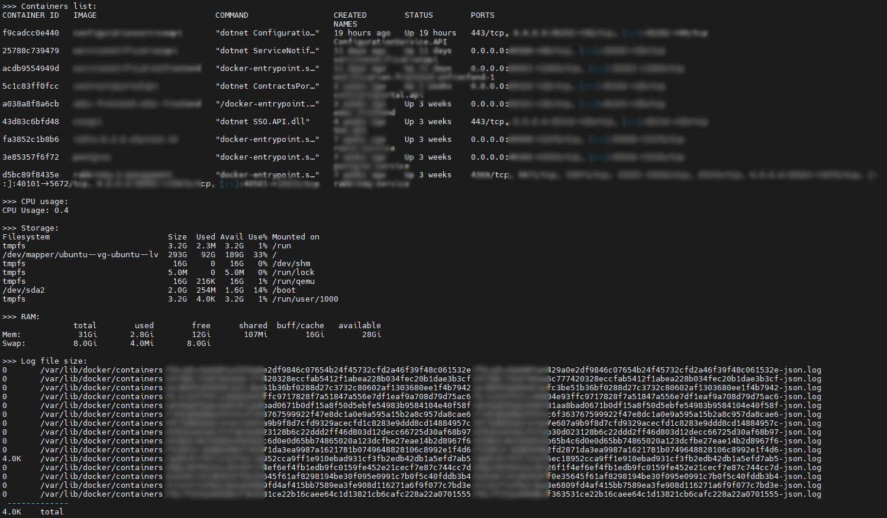

# docker-info
## View Linux server and Docker status at a glance.
View your docker info and server info (cli) , if you have swarm its possible to view swarm cluster info too.

Tested on OS(s): Debian and Ubuntu server .

How to use:

1- open your desired folder in your server to dowload files.
<br />
2- run following commands in your terminal:
<br />

```shell
sudo git clone https://github.com/EliasNaserkhaki/docker-info
cd docker-info/run
sudo chmod +x docker-info
./docker-info
```

<br />
Enjoy it, next time to run app just in docker-info/run  folder type  ./docker-info
<br /><br />
Features:

```ol
1 - show server and host information
2 - show server ip and route details
3 - show server public IP
4 - show firewall status
5 - show CPU usage
6 - show server storage info
7 - show RAM info
8 - show containers list
9 - show containers log file size and total
10- Remove all container logs at once
11 - show realtime container resource details
---- if Swarm mode eanabled : 
12 - show overall swarm  info
13 - show Swarm cluster nodes details
```

<br /><br />
Screenshots:

<br /><br />
<br /><br />
<br /><br />
<br /><br />
<br /><br />

